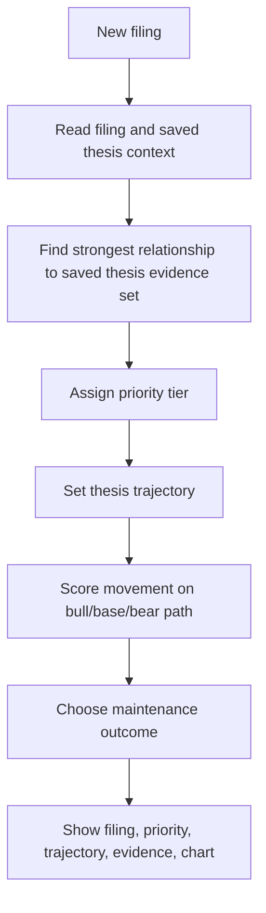
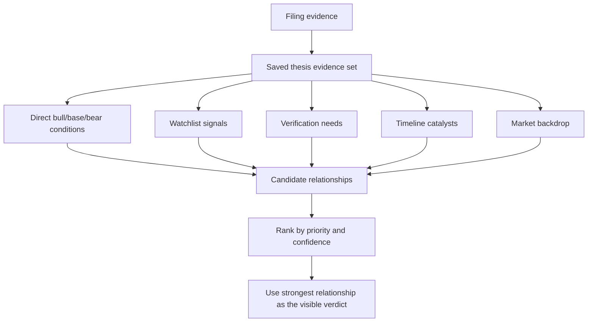
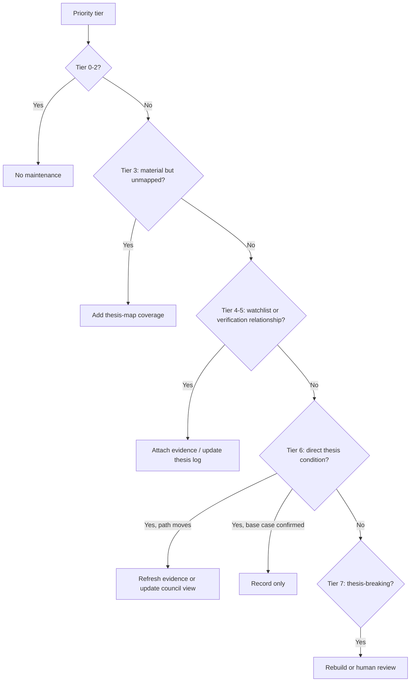
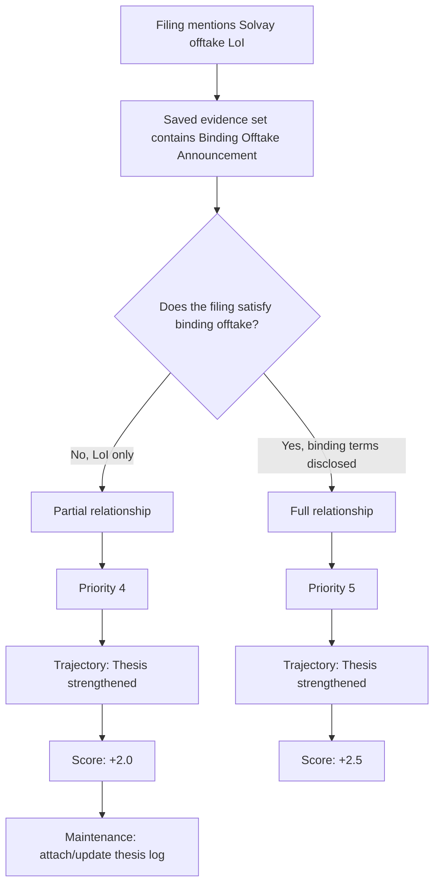

# Scenario Router Decision Model

The scenario router should be understood as a priority system, not a maze of separate flows.

It answers one question:

```text
How strongly does this filing relate to the saved thesis, and in which direction?
```

Everything else is secondary. Source quality, parsing, watchlist matches, verification items, market facts, and council maintenance are all supporting detail.

## The Simple Model



The router does not run four separate decision systems. It checks one evidence set.

That evidence set contains:

```text
saved bull/base/bear conditions
monitoring watchlist signals
verification queue items
timeline catalysts
market backdrop rules
```

Those are not different user-facing workflows. They are different sources of relationship evidence.

## Priority Ladder

The router should classify the filing by the strongest relationship it finds.

| Priority | Relationship to saved thesis | Meaning | Typical trajectory |
| ---: | --- | --- | --- |
| 0 | Administrative / procedural | Filing has no investment-thesis content. | Administrative |
| 1 | No relation found | Filing was read, but no thesis-relevant relationship was found. | No thesis change |
| 2 | Market backdrop only | External price/market rule moved, but filing itself did not change the thesis. | Market backdrop only |
| 3 | Material but unmapped | Filing appears material, but saved thesis evidence set does not cover it. | Material outside thesis map |
| 4 | Partial watchlist / verification relationship | Filing is a real precursor or partial answer to something the saved run told us to monitor. | Thesis strengthened / risk increased |
| 5 | Full watchlist / verification relationship | Filing satisfies a saved monitoring signal or verification need. | Thesis strengthened / risk reduced / risk increased |
| 6 | Direct thesis condition | Filing satisfies a saved bull/base/bear condition or failure condition. | Bull/base/bear path changes |
| 7 | Thesis-breaking evidence | Filing invalidates a core condition, introduces a red flag, or breaks the saved timeline. | Thesis weakened / urgent review |

The core rule:

```text
Higher priority wins.
```

Example:

```text
A filing can be medium material and also partially match a watchlist item.
It should not be reduced to "medium material".
It should be treated as Priority 4: partial saved-thesis relationship.
```

## Relationship Scan

The implementation may check several stores, but the product concept is one scan:



This is the important mental model:

```text
The filing is compared to one saved thesis evidence set.
Each hit gets a priority.
The visible verdict comes from the highest-priority hit.
```

## Match Strength

Every relationship has strength:

| Strength | Meaning |
| --- | --- |
| `none` | No useful relationship. |
| `partial` | Related to the saved thesis item, but does not satisfy it yet. |
| `full` | Satisfies the saved thesis item. |
| `contradicts` | Conflicts with a saved condition or assumption. |

Partial is not no-change.

```text
Partial means: this filing is relevant enough to move the thesis trajectory,
but not enough to say the saved catalyst has completed.
```

## Trajectory Labels

The visible labels should describe thesis movement, not backend workflow.

| Relationship result | User-facing label |
| --- | --- |
| Administrative / procedural | Administrative filing |
| No relationship and low materiality | No thesis change |
| Market-only context | Market backdrop only |
| Material filing with no saved relationship | Material outside thesis map |
| Partial positive watchlist / verification hit | Thesis strengthened |
| Full positive watchlist / thesis hit | Thesis strengthened |
| Partial negative red flag | Risk increased |
| Full red flag / failure condition | Thesis weakened |
| Timeline positive | Timeline accelerated |
| Timeline negative | Timeline delayed |
| Parser cannot classify | Needs classification |

The system should avoid labels like:

```text
run_delta_only
rerun_stage1
full_rerun
annotate_run
watch
```

Those are internal maintenance outcomes, not thesis verdicts.

## Scoring

The score is a path overlay. It prevents the router from flipping a stock from bear to bull on a single ordinary filing.

| Relationship | Score effect |
| --- | ---: |
| Material unmapped positive | usually `+2.0` |
| Partial confirmatory watchlist | `+2.0` |
| Full confirmatory watchlist | `+2.5` |
| Direct saved thesis condition | `+3.0` |
| Partial red flag | `-2.0` |
| Full red flag | `-3.0` |
| Direct failure condition | `-4.0` |

Scoring detail lives in:

```text
docs/scenario-router-trajectory-scoring-rubric.md
```

## Maintenance Outcome

Maintenance outcome is not the headline. It is the background handling step after the thesis relationship is known.



Backend action enums may still exist for implementation:

```text
ignore
annotate_run
run_delta_only
rerun_stage1
full_rerun
urgent_human_review
```

But user-facing UI and docs should translate them into:

```text
No maintenance
Attach to thesis log
Update thesis note
Refresh evidence pack
Rebuild council run
Human review now
```

## Solvay Offtake LoI

Input:

```text
VMM Signs Strategic Offtake/Tech Partnership LoI with Solvay
Saved signal: Binding Offtake Announcement
```

Correct path:



Correct interpretation:

```text
The LoI does not complete the binding offtake catalyst.
But it is close enough to the saved signal to matter.
So the verdict is not "No thesis change".
It is "Thesis strengthened" with partial validation.
```

## What The User Should See

For the Solvay filing, the first screen should read like:

```text
VMM Signs Strategic Offtake/Tech Partnership LoI with Solvay

Priority: Partial saved-thesis relationship
Trajectory: Thesis strengthened
Why: Related to saved signal "Binding Offtake Announcement", but not binding yet.
Score: +2.0
Maintenance: Attach to thesis log / update thesis note
```

The audit trail can still show:

```text
watchlist condition: Binding Offtake Announcement
match strength: partial
missing for full match: binding or definitive offtake terms
```

But that belongs below the verdict. It is justification, not the main structure.

## Anti-Patterns

Avoid these:

```text
Four separate diagrams for thesis map, watchlist, verification, and market.
Backend action labels as user-facing verdicts.
Treating partial watchlist hits as no-change.
Asking the user to route the filing manually after the router already classified it.
Showing maintenance before thesis movement.
```

Use this instead:

```text
One saved thesis evidence set.
One priority ladder.
One trajectory verdict.
One score.
One maintenance outcome.
```
