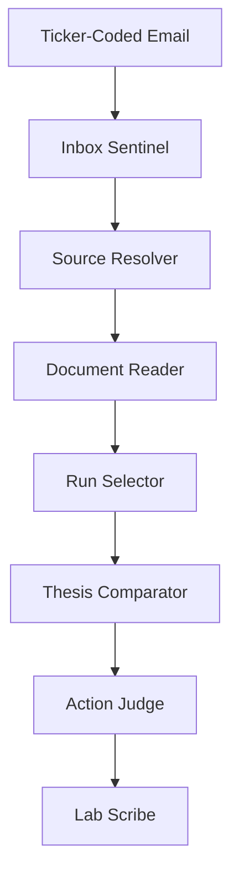

# Scenario Router Plan (2026-04-06)

## Why This Exists

The current age-only freshness layer is too thin.

Today we mostly have:
- artifact-age freshness from `/Users/Toms_Macbook/Projects/llm-council/backend/main.py`
- a lightweight retrieval-based delta check from `/Users/Toms_Macbook/Projects/llm-council/backend/delta_monitor.py`
- deterministic ASX announcement ingestion inside Stage 1 from `/Users/Toms_Macbook/Projects/llm-council/backend/council.py`

That gives us:
- "this run is 18 days old"
- "there may be new material filings"

It does **not** yet give us a strong workflow for:
- ingesting a new company announcement as an event
- comparing that announcement to the latest lab state
- deciding whether the run is still valid
- routing to the right follow-up action

This plan turns that into an event-driven runner-agent system.

## Core Product Goal

When a ticker-coded email arrives with a new company announcement:

1. identify the ticker and announcement
2. fetch and parse the underlying document
3. compare the new information against the latest saved lab run
4. decide whether the announcement is:
   - noise
   - watchlist-only
   - thesis-relevant
   - rerun-worthy
   - urgent / invalidating
5. write a structured verdict and recommended next step
6. optionally trigger the appropriate downstream workflow

This should feel like a real monitoring system, not just "age in days."

## Proposed Agent Set

We should give the subagents fixed names and responsibilities.

### 1. `Inbox Sentinel`
Role:
- watches the dedicated mailbox
- detects ticker-coded inbound mail
- normalizes message metadata
- extracts URLs/attachments

Input:
- email envelope
- subject line
- body
- attachments

Output:
- `announcement_event`

Responsibilities:
- parse ticker from subject / sender / attachment naming
- reject spam/noise
- dedupe already-seen announcements
- classify source confidence:
  - exchange
  - IR
  - wire
  - unknown

### 2. `Source Resolver`
Role:
- turns the email into a canonical announcement artifact

Input:
- `announcement_event`

Output:
- `announcement_packet`

Responsibilities:
- follow the best canonical source URL
- prefer exchange-hosted announcement PDFs when available
- store:
  - title
  - published_at
  - source_url
  - source_type
  - attachment path

### 3. `Document Reader`
Role:
- parse the actual announcement content

Input:
- `announcement_packet`

Output:
- `announcement_facts`

Responsibilities:
- run through the existing document pipeline
- extract:
  - clean text
  - headings
  - table fragments if possible
  - short factual bullet summary
- preserve provenance for every extracted fact

This should reuse the existing parser stack where possible.

### 4. `Run Selector`
Role:
- find the latest relevant lab result for the ticker

Input:
- ticker / exchange

Output:
- `baseline_run_packet`

Responsibilities:
- choose latest saved run
- load:
  - summary fields
  - freshness
  - delta check
  - structured data
  - analyst/chairman memos

This should reuse the existing run packet/integration packet shape in `/Users/Toms_Macbook/Projects/llm-council/backend/main.py`.

### 5. `Thesis Comparator`
Role:
- compare the new announcement to the baseline run

Input:
- `announcement_facts`
- `baseline_run_packet`

Output:
- `comparison_report`

Responsibilities:
- determine whether the announcement:
  - confirms existing milestones
  - accelerates the timeline
  - delays the timeline
  - changes financing assumptions
  - changes permits/regulatory status
  - changes production/ramp assumptions
  - undermines key thesis conditions
- classify impact level:
  - `none`
  - `low`
  - `medium`
  - `high`
  - `critical`

This is the real scenario-router brain.

### 6. `Action Judge`
Role:
- decide what to do next

Input:
- `comparison_report`

Output:
- `action_decision`

Allowed actions:
- `ignore`
- `watch`
- `annotate_run`
- `run_delta_only`
- `rerun_stage1`
- `full_rerun`
- `urgent_human_review`

This should be rule-first, not model-first.

### 7. `Lab Scribe`
Role:
- persist the result back into the app

Input:
- `announcement_packet`
- `comparison_report`
- `action_decision`

Output:
- saved artifact(s)

Responsibilities:
- save an event artifact
- append a scenario-router decision log
- attach the verdict to the latest run
- expose it in the lab UI later

## Agent Naming Summary

Recommended stable names:
- `Inbox Sentinel`
- `Source Resolver`
- `Document Reader`
- `Run Selector`
- `Thesis Comparator`
- `Action Judge`
- `Lab Scribe`

These are concrete enough to be memorable without being cute.

## Event Contract

### `announcement_event`

```json
{
  "event_id": "uuid",
  "received_at_utc": "2026-04-06T08:00:00Z",
  "source_channel": "email",
  "sender": "asxonline@asx.com.au",
  "subject": "ASX:BTR - Quarterly Activities Report",
  "ticker": "ASX:BTR",
  "exchange": "ASX",
  "company_hint": "Brightstar Resources Limited",
  "urls": [],
  "attachments": [
    {
      "filename": "BTR-quarterly.pdf",
      "content_type": "application/pdf",
      "local_path": "/absolute/path/to/file.pdf"
    }
  ]
}
```

### `announcement_packet`

```json
{
  "event_id": "uuid",
  "ticker": "ASX:BTR",
  "exchange": "ASX",
  "title": "Quarterly Activities Report",
  "published_at_utc": "2026-04-06T07:30:00Z",
  "source_url": "https://announcements.asx.com.au/...",
  "source_type": "exchange_filing",
  "document_path": "/absolute/path/to/file.pdf",
  "document_sha256": "..."
}
```

### `comparison_report`

```json
{
  "ticker": "ASX:BTR",
  "baseline_run_id": "run_...",
  "announcement_title": "Quarterly Activities Report",
  "impact_level": "medium",
  "thesis_effect": "partially_confirms",
  "timeline_effect": "on_track",
  "capital_effect": "no_material_change",
  "key_findings": [
    {
      "type": "milestone_confirmation",
      "summary": "Laverton toll-treatment pathway remains active.",
      "evidence": {
        "source_url": "https://...",
        "quote_excerpt": "..."
      }
    }
  ],
  "conflicts_with_run": [],
  "recommended_action": "annotate_run"
}
```

## Email-Driven Workflow



## Email Strategy

Create a dedicated mailbox for this system.

Recommended pattern:
- one separate mailbox for machine-readable inbound announcements
- only forward ticker-coded sources there

Examples:
- ASX announcement alerts
- IR mailing lists
- GlobeNewswire / Newsfile for TSX names
- RNS / Investegate for LSE names

The important thing is not the provider. The important thing is:
- low-noise mailbox
- one ingestion path
- deterministic subject/body parsing

## Trigger Strategy

V1 trigger:
- poll mailbox every few minutes

V2 trigger:
- webhook into the app or a small ingestion service

For now, polling is good enough and simpler.

## Recommended Decision Rules

These should be deterministic first.

### `ignore`
Use when:
- routine Appendix / admin / legal notice
- no thesis-relevant facts found
- duplicate announcement already processed

### `watch`
Use when:
- low-signal update
- useful context but no thesis change

### `annotate_run`
Use when:
- announcement confirms or slightly updates current thesis
- no rerun needed

### `run_delta_only`
Use when:
- moderate update
- enough to refresh the delta view but not enough for a full rerun

### `rerun_stage1`
Use when:
- the announcement changes core evidence but not enough to invalidate Stage 2/3 structure entirely

### `full_rerun`
Use when:
- financing
- reserves/resources
- permits
- development timeline
- major M&A / ownership change
- material production guidance change

### `urgent_human_review`
Use when:
- likely thesis break
- contradictory disclosure
- severe financing/liquidity issue
- suspension / trading halt paired with unclear catalyst

## How This Relates To Existing Code

### Existing pieces we should reuse

#### 1. Run freshness metadata
- `/Users/Toms_Macbook/Projects/llm-council/backend/main.py`
- `_compute_run_freshness(...)`

This stays, but becomes only one input signal.

#### 2. Lightweight delta checking
- `/Users/Toms_Macbook/Projects/llm-council/backend/delta_monitor.py`
- `run_delta_check(...)`

This becomes a supporting tool, not the whole feature.

#### 3. Deterministic ASX announcement ingestion
- `/Users/Toms_Macbook/Projects/llm-council/backend/council.py`
- `_collect_deterministic_asx_sources(...)`
- `_augment_run_with_deterministic_asx_sources(...)`

We should extract/reuse this logic for the email-triggered path instead of rebuilding it from scratch.

#### 4. Document pipeline
- `/Users/Toms_Macbook/Projects/llm-council/backend/document_pipeline/`

This should become the `Document Reader`.

## Proposed Backend Modules

Add these modules:

- `/Users/Toms_Macbook/Projects/llm-council/backend/scenario_router/inbox_sentinel.py`
- `/Users/Toms_Macbook/Projects/llm-council/backend/scenario_router/source_resolver.py`
- `/Users/Toms_Macbook/Projects/llm-council/backend/scenario_router/document_reader.py`
- `/Users/Toms_Macbook/Projects/llm-council/backend/scenario_router/run_selector.py`
- `/Users/Toms_Macbook/Projects/llm-council/backend/scenario_router/thesis_comparator.py`
- `/Users/Toms_Macbook/Projects/llm-council/backend/scenario_router/action_judge.py`
- `/Users/Toms_Macbook/Projects/llm-council/backend/scenario_router/lab_scribe.py`
- `/Users/Toms_Macbook/Projects/llm-council/backend/scenario_router/models.py`
- `/Users/Toms_Macbook/Projects/llm-council/backend/scenario_router/service.py`

Storage:
- `/Users/Toms_Macbook/Projects/llm-council/outputs/scenario_router_events/`

## Proposed UI Surface

Eventually expose in the lab:

- latest announcement seen
- latest scenario-router verdict
- action recommendation
- whether the run is now:
  - fresh
  - watching
  - outdated due to new filing
  - invalidated

This should be richer than the current age-only freshness badge.

## Suggested V1 Build Order

### Phase 1
- ingest ticker-coded emails
- parse attachment/url
- save normalized announcement event
- load latest run for ticker
- basic rule-based compare
- write verdict artifact

### Phase 2
- reuse deterministic exchange-announcement fetchers
- add exchange-specific source handling:
  - ASX
  - TSX
  - LSE
- richer action rules

### Phase 3
- trigger downstream actions automatically
- lab UI integration
- email digest / inbox integration

## Concrete First Implementation

The first useful version should **not** try to do everything.

Build this:

1. mailbox poller
2. ASX-first announcement normalization
3. PDF/text parse through existing document pipeline
4. latest-run lookup by ticker
5. simple comparator on:
   - milestones
   - financing
   - permits
   - timeline slippage
   - negative surprise terms
6. action judge
7. artifact save

That gets us a real working "scenario router" without pretending we already have a complete cross-exchange event engine.

## Non-Goals For V1

Do not try to:
- rerun the full council automatically on day one
- support every exchange at once
- build a full email UI first
- make the comparator fully model-driven

Rule-first, event-driven, artifact-backed is the right starting point.

## Recommended Next Step

Implement the skeleton service and models first:

- `scenario_router/models.py`
- `scenario_router/service.py`
- `scenario_router/action_judge.py`

Then wire a single entrypoint like:

```python
async def process_announcement_event(event: AnnouncementEvent) -> ScenarioRouterDecision:
    ...
```

That gives us a real spine before we build the mailbox listener.
